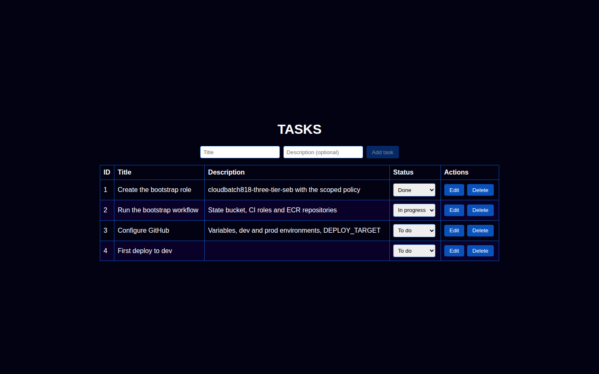
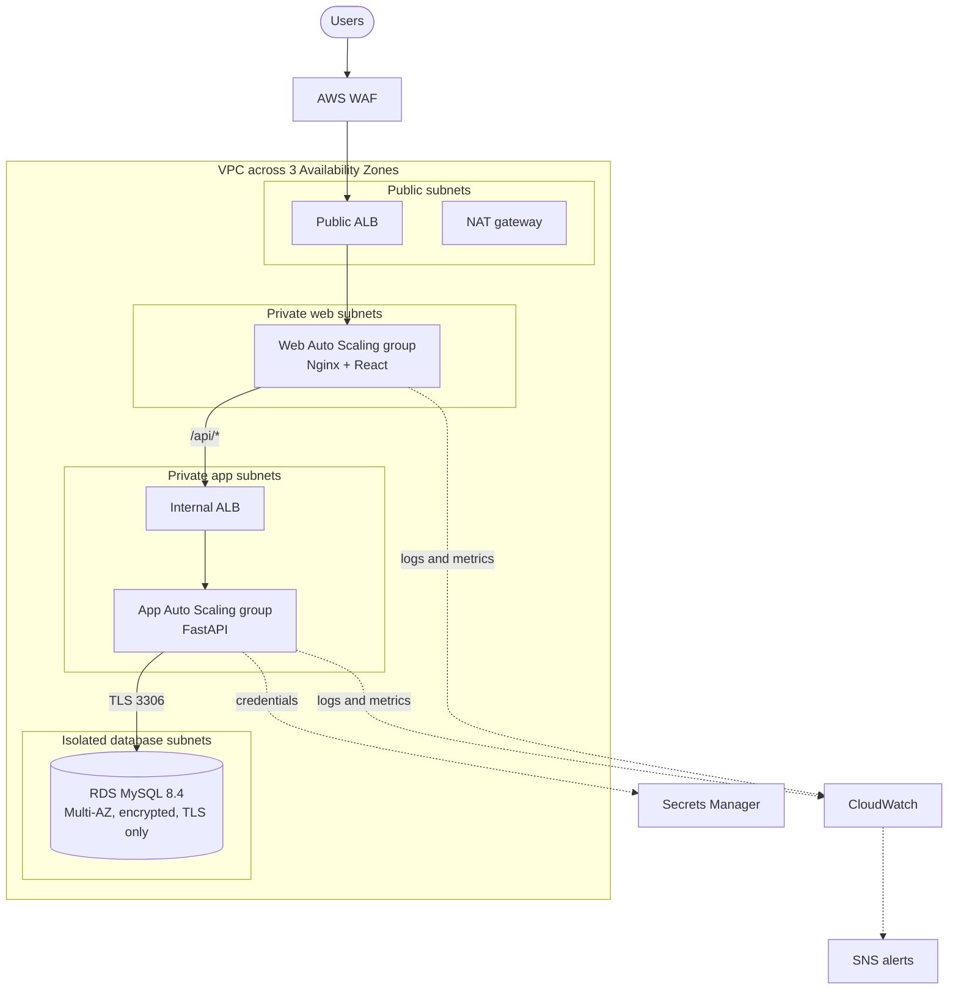
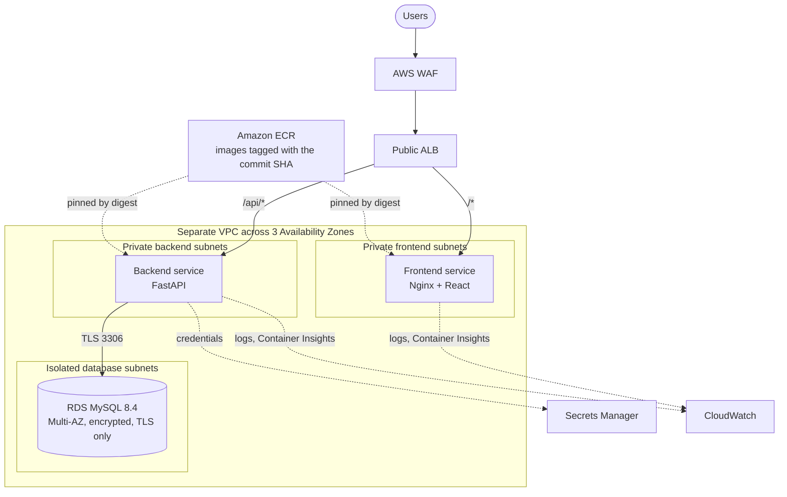
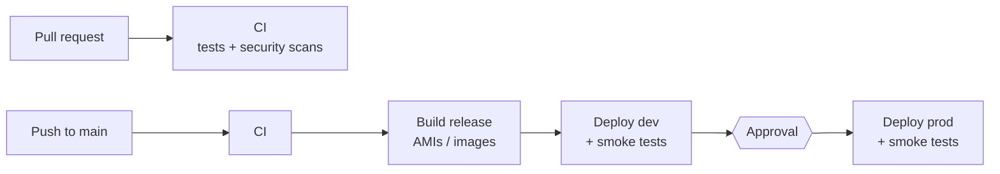

# AWS 3-Tier Tasks App — EC2 and ECS

[](https://github.com/ngems1/3tier-app/actions/workflows/deploy-ec2.yml)
[](https://github.com/ngems1/3tier-app/actions/workflows/deploy-ecs.yml)

A production-style **3-tier web application on AWS**, built with Terraform and
delivered by GitHub Actions. The same app can run on **EC2** (Project 1) or on
**ECS Fargate** (Project 2) — you choose with one setting.

| Tier | Technology |
|---|---|
| Presentation | React task list served by Nginx |
| Application | FastAPI REST API (Python 3.11) |
| Data | Amazon RDS for MySQL 8.4 (Multi-AZ, encrypted, TLS only) |



---

## Highlights

- **Two deployment targets, one codebase** — EC2 Auto Scaling groups with
  Packer-baked AMIs, or ECS Fargate services with images from ECR.
- **Infrastructure as code** — everything is Terraform: VPC across 3
  Availability Zones, load balancers, WAF, compute, RDS, KMS, IAM, alarms and
  dashboards. Offline tests with a mocked AWS provider.
- **Secure CI/CD** — GitHub Actions signs in to AWS with **OIDC** (no stored AWS
  keys), with separate least-privilege roles for plan, build and deploy.
- **Quality and security gates** — lint, unit tests, Terraform validate/tests,
  Checkov, Trivy (code and images), CodeQL, pip-audit and npm audit before
  anything is deployed.
- **Immutable releases** — every release is the git commit SHA: AMIs, Docker
  images and artifacts are tagged with it and never overwritten.
- **Safe deployments** — rolling updates with automatic rollback (ASG instance
  refresh / ECS circuit breaker), smoke tests after every deploy, and a manual
  approval before production.
- **Operations built in** — CloudWatch logs, metrics, alarms and dashboards,
  one-click rollback to any previous release, and a Destroy workflow to remove
  an environment when you're done.

---

## Architecture

### Project 1 — EC2



### Project 2 — ECS Fargate



Each platform has its **own VPC, load balancer and database**, so they never
affect each other. Because the shared AWS account has reached its VPC quota,
the environments currently build their subnets, NAT gateway and route tables
inside the account's existing default VPC, each on its own address ranges
(setting `existing_vpc_id`, see [docs/setup.md](docs/setup.md#vpc-quota-full-use-an-existing-vpc)). HTTPS with a custom domain turns on automatically once a
Route 53 hosted zone is configured; until then the app is served over HTTP on
the load balancer's address.

---

## Tech stack

| Area | Tools |
|---|---|
| Frontend | React 18, Nginx (unprivileged), Jest + Testing Library |
| Backend | FastAPI, Uvicorn, PyMySQL, boto3, pytest, ruff |
| Database | Amazon RDS for MySQL 8.4, credentials in Secrets Manager |
| Infrastructure | Terraform, AWS (VPC, ALB, WAF, EC2, Auto Scaling, ECS Fargate, ECR, RDS, KMS, IAM, CloudWatch, SNS, SSM, S3) |
| Images | Packer (AMIs), Docker (containers) |
| CI/CD | GitHub Actions with OIDC, GitHub Environments for approvals |
| Security scanning | Checkov, Trivy, CodeQL, pip-audit, npm audit, ECR scan on push |

---

## Repository layout

```
.
├── app/
│   ├── backend/            FastAPI API, Dockerfile, pinned requirements
│   └── frontend/           React app, Nginx config, Dockerfile
├── deploy/
│   ├── ec2/                Packer template, provisioning and hardening scripts
│   └── ecs/                Rollout check for ECS deployments
├── infra/terraform/
│   ├── state-bucket/       S3 bucket for Terraform state (one-time)
│   ├── bootstrap/          OIDC roles, artifact bucket, ECR repos (one-time)
│   ├── modules/            network, alb, compute, database, ecs, observability, …
│   └── environments/       dev, prod (EC2) · ecs-dev, ecs-prod (ECS)
├── tests/
│   ├── backend/            pytest unit tests
│   └── smoke/              post-deployment smoke test
├── docs/                   setup, architecture, runbook, checklists
└── .github/workflows/      CI, deploy, bootstrap and destroy pipelines
```

---

## Run it locally

Requires Docker.

```bash
docker compose up --build
```

- App: <http://localhost:8080>
- API: <http://localhost:8000/api/tasks> — interactive docs at <http://localhost:8000/docs>

Run the same checks as the pipeline:

```bash
# Backend
pip install -r app/backend/requirements-dev.txt
ruff check . && pytest

# Frontend
cd app/frontend
npm ci && npm run lint && npm run test:ci && npm run build
```

### API

| Method | Path | Description |
|---|---|---|
| `GET` | `/healthz` | Liveness (used by the load balancer) |
| `GET` | `/api/healthz` | Readiness, including the database |
| `GET` | `/api/tasks` | List tasks |
| `POST` | `/api/tasks` | Create a task |
| `GET` | `/api/tasks/{id}` | Get a task |
| `PUT` | `/api/tasks/{id}` | Update a task (title, description, status) |
| `DELETE` | `/api/tasks/{id}` | Delete a task |

---

## CI/CD pipeline



| Workflow | When | What it does |
|---|---|---|
| `ci.yml` | Every pull request (and before every deploy) | Lint, tests, Terraform checks, Checkov, Trivy, CodeQL, dependency audits, read-only plans |
| `deploy-ec2.yml` | Push to `main` or manual | Builds AMIs + images, deploys dev, then prod after approval |
| `deploy-ecs.yml` | Push to `main` or manual | Builds images, deploys ECS dev, then prod after approval |
| `bootstrap.yml` | Manual, once | Creates the state bucket, OIDC roles, artifact bucket and ECR repos |
| `destroy.yml` | Manual | Removes one environment (typed confirmation; prod needs approval) |

**Choose where to deploy** with the repository variable `DEPLOY_TARGET`:

| `DEPLOY_TARGET` | A push to `main` deploys to |
|---|---|
| `ec2` or not set | EC2 |
| `ecs` | ECS |
| `both` | EC2 and ECS |

Running a deploy workflow manually always deploys to its own platform.

---

## Deploying to AWS

Full step-by-step guide: **[docs/setup.md](docs/setup.md)**. In short:

1. **One-time AWS setup** — create the GitHub OIDC identity provider and a
   bootstrap role (trust policy and permissions in
   [`docs/bootstrap-role-trust-policy.json`](docs/bootstrap-role-trust-policy.json)
   and [`docs/bootstrap-role-policy.json`](docs/bootstrap-role-policy.json)).
2. **GitHub environments** — create `dev` and `prod` (prod: required reviewer,
   `main` only, variable `AWS_BOOTSTRAP_ROLE_ARN`).
3. **Bootstrap** — run *Actions → Bootstrap AWS account*, first as a plan, then
   with **apply**. It creates the state bucket, the pipeline roles, the
   artifact bucket and the ECR repositories.
4. **GitHub variables** — copy the values from the bootstrap run summary:

   | Where | Variables |
   |---|---|
   | Repository | `AWS_REGION`, `AWS_PLAN_ROLE_ARN`, `AWS_BUILD_ROLE_ARN`, `ARTIFACT_BUCKET`, optional `DEPLOY_TARGET` |
   | `dev` and `prod` environments | `AWS_DEPLOY_ROLE_ARN` |

5. **Deploy** — push to `main`, or run *Deploy EC2* / *Deploy ECS* manually.
   The app URL is shown in the run summary.

**Rollback:** run *Deploy EC2* or *Deploy ECS* manually with the previous
commit SHA as `version` — nothing is rebuilt.

**Clean up:** run *Actions → Destroy*, choose the platform and environment,
and type the stack name (`dev`, `prod`, `ecs-dev` or `ecs-prod`) to confirm.

> **Cost:** an environment is billed by the hour while it exists (NAT gateway,
> load balancers, RDS, EC2 or Fargate). Destroy test environments when you're
> done and consider an AWS Budgets alert.

---

## Security

- **No long-lived AWS keys** — GitHub Actions uses OIDC; each role trusts only
  this repository and, for deploy roles, only its GitHub Environment.
- **Least privilege** — separate plan (read-only), build and per-environment
  deploy roles; separate runtime roles per tier; only the API can read the
  database secret.
- **Private by default** — only the public load balancer accepts internet
  traffic; servers and containers live in private subnets; the database has no
  internet route. No SSH (EC2 access through SSM Session Manager).
- **Encryption** — KMS keys per environment for RDS, secrets, logs and alerts;
  encrypted EBS and S3; TLS to the database is required.
- **Edge protection** — AWS WAF with AWS managed rules (common threats, known
  bad inputs including Log4j, IP reputation).
- **Supply chain** — pinned dependencies, image scanning, and security gates
  that block a release on critical findings.

## Observability

- CloudWatch dashboards per environment (requests, errors, latency, CPU,
  memory, capacity, database).
- Alarms for unhealthy targets, 5XX errors, p95 latency, CPU, memory,
  capacity and RDS health, sent to SNS (email optional).
- Centralized logs with per-environment retention; ALB access logs in S3;
  WAF and VPC flow logs.

---

## Documentation

| Document | Contents |
|---|---|
| [docs/setup.md](docs/setup.md) | One-time setup and first deployment |
| [docs/architecture.md](docs/architecture.md) | Architecture and security controls in detail |
| [docs/runbook.md](docs/runbook.md) | Operations: access, incidents, scaling, rollback, destroy |
| [docs/release-checklist.md](docs/release-checklist.md) | What to check before and after a production release |
| [docs/plan-alignment.md](docs/plan-alignment.md) | How the repository maps to the project plan |

---

## Author

**Sebastien Ngembou** — [github.com/ngems1](https://github.com/ngems1)
