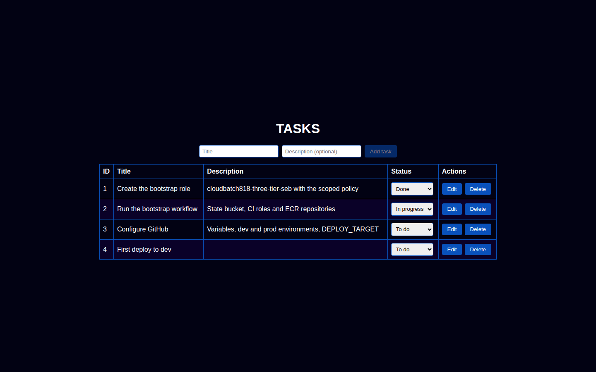
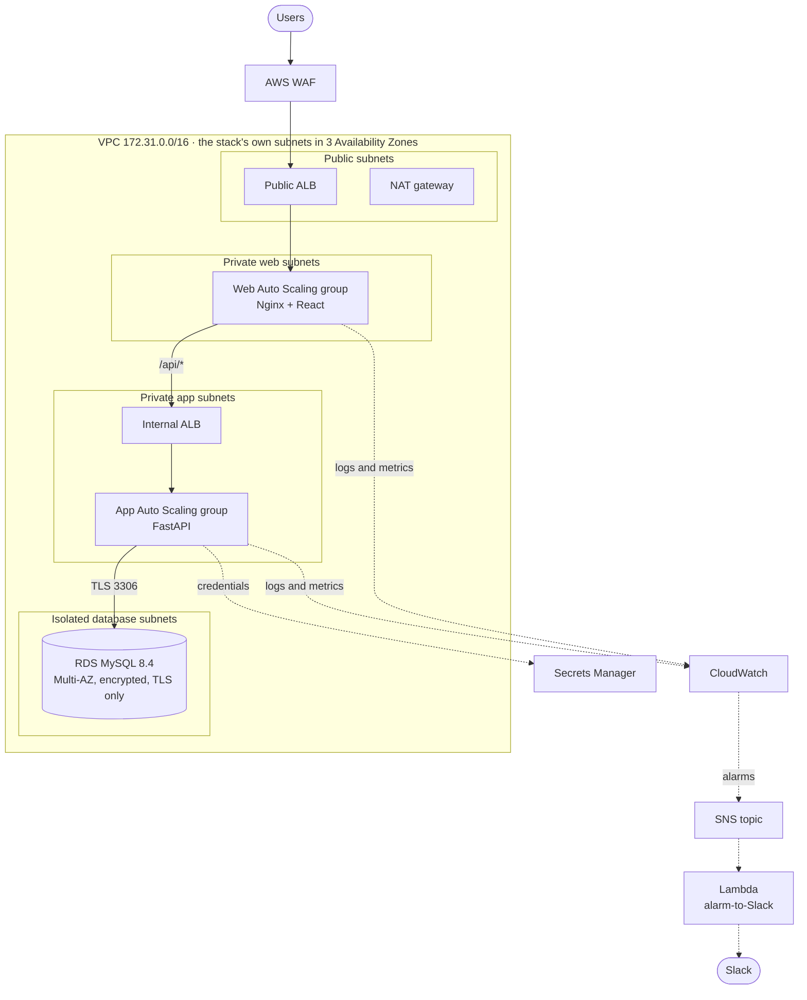
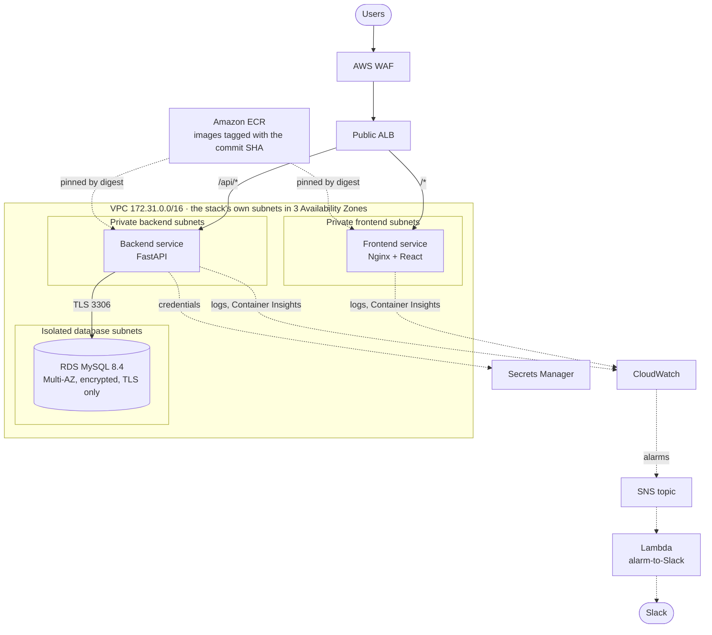
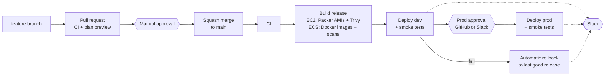
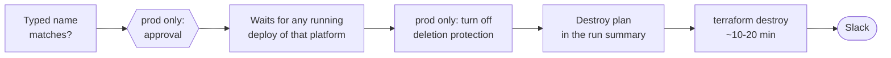

# AWS 3-Tier Tasks App — EC2 and ECS

[](https://github.com/ngems1/3tier-app/actions/workflows/deploy-ec2.yml)
[](https://github.com/ngems1/3tier-app/actions/workflows/deploy-ecs.yml)

A production-style **3-tier web application on AWS**, built with Terraform and
delivered by GitHub Actions. The same app can run on **EC2** (Project 1) or on
**ECS Fargate** (Project 2) — you choose with one setting.

| Tier | Technology |
|---|---|
| Presentation | React task list served by Nginx |
| Application | FastAPI REST API (Python 3.11) |
| Data | Amazon RDS for MySQL 8.4 (Multi-AZ, encrypted, TLS only) |



---

## Highlights

- **Two deployment targets, one codebase** — EC2 Auto Scaling groups with
  Packer-baked AMIs, or ECS Fargate services with images from ECR.
- **Infrastructure as code** — everything is Terraform: VPC across 3
  Availability Zones, load balancers, WAF, compute, RDS, KMS, IAM, alarms and
  dashboards. Offline tests with a mocked AWS provider.
- **Secure CI/CD** — GitHub Actions signs in to AWS with **OIDC** (no stored AWS
  keys), with separate least-privilege roles for plan, build and deploy.
  Production can only be deployed from `main`, after an approval.
- **HTTPS on a real domain** — every environment is served at
  `https://<env>.sebngembou-cloud.click` (Route 53 + ACM certificate, TLS 1.3,
  HTTP redirected to HTTPS).
- **GitHub Flow** — every change goes through a pull request: CI, a read-only
  Terraform plan preview and a manual approval gate before it can be merged
  into a protected `main`.
- **Quality and security gates** — lint, unit tests, Terraform validate/tests,
  Checkov, Trivy (code, Docker images and every AMI), CodeQL, pip-audit and
  npm audit before anything is deployed.
- **Immutable releases** — every release is the git commit SHA: AMIs, Docker
  images and artifacts are tagged with it and never overwritten.
- **Safe deployments** — rolling updates with automatic rollback (ASG instance
  refresh / ECS circuit breaker), smoke tests after every deploy, an
  **automatic rollback to the last good release when the smoke tests fail**,
  and a manual approval before production.
- **Reliable pipeline** — tool downloads retry on errors, documentation-only
  changes don't deploy, and each platform builds only what it runs (EC2:
  Packer AMIs, ECS: Docker images).
- **Slack notifications** — deploy results, prod waiting for approval (with
  the plan summary), automatic rollbacks, pipeline failures, and CloudWatch
  alarms from every environment (through a small Lambda function). With the
  GitHub app for Slack, prod can be approved from Slack.
- **Operations built in** — CloudWatch logs, metrics, alarms and dashboards,
  one-click rollback to any previous release, a nightly drift check, and a
  Destroy workflow to remove an environment when you're done.

---

## Architecture

### Project 1 — EC2


```mermaid
flowchart TB
    user([Users]) --> waf[AWS WAF]
    waf --> alb[Public ALB]
    subgraph vpc[VPC 172.31.0.0/16 · the stack's own subnets in 3 Availability Zones]
        subgraph public[Public subnets]
            alb
            nat[NAT gateway]
        end
        subgraph web[Private web subnets]
            webasg[Web Auto Scaling group<br/>Nginx + React]
        end
        subgraph app[Private app subnets]
            ialb[Internal ALB]
            appasg[App Auto Scaling group<br/>FastAPI]
        end
        subgraph data[Isolated database subnets]
            rds[(RDS MySQL 8.4<br/>Multi-AZ, encrypted, TLS only)]
        end
    end
    alb --> webasg
    webasg -->|/api/*| ialb --> appasg
    appasg -->|TLS 3306| rds
    appasg -.->|credentials| sm[Secrets Manager]
    webasg & appasg -.->|logs and metrics| cw[CloudWatch]
    cw -.->|alarms| sns[SNS topic]
    sns -.-> lambda[Lambda<br/>alarm-to-Slack] -.-> slack([Slack])
```

### Project 2 — ECS Fargate


```mermaid
flowchart TB
    user([Users]) --> waf[AWS WAF]
    waf --> alb[Public ALB]
    subgraph vpc[VPC 172.31.0.0/16 · the stack's own subnets in 3 Availability Zones]
        subgraph fe[Private frontend subnets]
            fsvc[Frontend service<br/>Nginx + React]
        end
        subgraph be[Private backend subnets]
            bsvc[Backend service<br/>FastAPI]
        end
        subgraph data[Isolated database subnets]
            rds[(RDS MySQL 8.4<br/>Multi-AZ, encrypted, TLS only)]
        end
    end
    alb -->|/*| fsvc
    alb -->|/api/*| bsvc
    bsvc -->|TLS 3306| rds
    ecr[Amazon ECR<br/>images tagged with the commit SHA] -.->|pinned by digest| fsvc & bsvc
    bsvc -.->|credentials| sm[Secrets Manager]
    fsvc & bsvc -.->|logs, Container Insights| cw[CloudWatch]
    cw -.->|alarms| sns[SNS topic]
    sns -.-> lambda[Lambda<br/>alarm-to-Slack] -.-> slack([Slack])
```

Each environment has its **own subnets, NAT gateway, load balancers, database
and security groups**, so stacks never affect each other. The network module
can create a dedicated VPC per environment; because the shared AWS account has
reached its VPC quota, the environments currently build their subnets inside
the account's existing default VPC (`existing_vpc_id`), each on its own
address ranges:

| Stack | Subnet ranges (172.31.x.0/24) |
|---|---|
| EC2 dev | 172.31.128 – 139 |
| EC2 prod | 172.31.144 – 155 |
| ECS dev | 172.31.160 – 171 |
| ECS prod | 172.31.176 – 187 |

See [docs/setup.md](docs/setup.md#vpc-quota-full-use-an-existing-vpc). Every
environment is served over **HTTPS** on the domain `sebngembou-cloud.click`
(Route 53, ACM certificate, HTTP redirected to HTTPS):

| Stack | Address |
|---|---|
| EC2 dev | `https://dev.sebngembou-cloud.click` |
| EC2 prod | `https://prod.sebngembou-cloud.click` |
| ECS dev | `https://ecs-dev.sebngembou-cloud.click` |
| ECS prod | `https://ecs.sebngembou-cloud.click` |

**Database connection hardening:** the API verifies the RDS certificate
against the RDS CA bundle (TLS required); the RDS parameter group sets
`skip_name_resolve` and a high `max_connect_errors` so app hosts are never
locked out; and the API starts even when the database is unreachable,
retrying the connection in the background (liveness stays green, readiness
reports `database: down`).

---

## Tech stack

| Area | Tools |
|---|---|
| Frontend | React 18, Nginx (unprivileged), Jest + Testing Library |
| Backend | FastAPI, Uvicorn, PyMySQL, boto3, pytest, ruff |
| Database | Amazon RDS for MySQL 8.4, credentials in Secrets Manager |
| Infrastructure | Terraform, AWS (VPC, ALB, WAF, EC2, Auto Scaling, ECS Fargate, ECR, RDS, KMS, IAM, CloudWatch, SNS, Lambda, SSM, S3) |
| Images | Packer (AMIs), Docker (containers) |
| CI/CD | GitHub Actions with OIDC, GitHub Environments for approvals, GitHub Flow with branch protection |
| Notifications | Slack (incoming webhook + GitHub app for Slack) |
| Security scanning | Checkov, Trivy (code, images, AMIs), CodeQL, pip-audit, npm audit, ECR scan on push |

---

## Repository layout

```
.
├── app/
│   ├── backend/            FastAPI API, Dockerfile, pinned requirements
│   └── frontend/           React app, Nginx config, Dockerfile
├── deploy/
│   ├── ec2/                Packer template, provisioning and hardening scripts
│   └── ecs/                Rollout check for ECS deployments
├── infra/terraform/
│   ├── state-bucket/       S3 bucket for Terraform state (one-time)
│   ├── bootstrap/          OIDC roles, artifact bucket, ECR repos (one-time)
│   ├── modules/            network, alb, compute, database, ecs, observability,
│   │                       alarm-slack (CloudWatch alarms → Slack Lambda), …
│   └── environments/       dev, prod (EC2) · ecs-dev, ecs-prod (ECS)
├── tests/
│   ├── backend/            pytest unit tests
│   ├── lambda/             unit tests of the alarm-to-Slack function
│   └── smoke/              post-deployment smoke test
├── docs/                   setup, architecture, runbook, checklists
└── .github/
    ├── workflows/          CI, deploy, bootstrap and destroy pipelines
    ├── actions/            shared steps: setup-hashicorp (retrying installs),
    │                       slack-notify, destroy-guard
    └── pull_request_template.md
```

---

## Run it locally

Requires Docker.

```bash
docker compose up --build
```

- App: <http://localhost:8080>
- API: <http://localhost:8000/api/tasks> — interactive docs at <http://localhost:8000/docs>

Run the same checks as the pipeline:

```bash
# Backend
pip install -r app/backend/requirements-dev.txt
ruff check . && pytest

# Frontend
cd app/frontend
npm ci && npm run lint && npm run test:ci && npm run build
```

### API

| Method | Path | Description |
|---|---|---|
| `GET` | `/healthz` | Liveness (used by the load balancer) |
| `GET` | `/api/healthz` | Readiness, including the database |
| `GET` | `/api/tasks` | List tasks |
| `POST` | `/api/tasks` | Create a task |
| `GET` | `/api/tasks/{id}` | Get a task |
| `PUT` | `/api/tasks/{id}` | Update a task (title, description, status) |
| `DELETE` | `/api/tasks/{id}` | Delete a task |

---

## CI/CD pipeline


```mermaid
flowchart LR
    branch[feature branch] --> pr[Pull request<br/>CI + plan preview]
    pr --> gate{{Manual approval}} --> merge[Squash merge<br/>to main]
    merge --> ci2[CI] --> build[Build release<br/>EC2: Packer AMIs + Trivy<br/>ECS: Docker images + scans]
    build --> dev[Deploy dev<br/>+ smoke tests]
    dev -->|fail| rb[Automatic rollback<br/>to last good release]
    dev --> approve{{Prod approval<br/>GitHub or Slack}} --> prod[Deploy prod<br/>+ smoke tests]
    dev & prod & rb -.-> slack([Slack])
```

| Workflow | When | What it does |
|---|---|---|
| `ci.yml` | Every pull request (and before every deploy) | Lint, tests, Terraform checks, Checkov, Trivy, CodeQL, dependency audits, read-only plans, and the **Manual approval** gate on pull requests |
| `deploy-ec2.yml` | Push to `main` (except docs-only changes) or manual | Builds the AMIs with Packer, deploys EC2 dev, then prod after approval |
| `deploy-ecs.yml` | Push to `main` (except docs-only changes) or manual | Builds and scans the Docker images, deploys ECS dev, then prod after approval |
| `bootstrap.yml` | Manual (once, and after changes to `infra/terraform/bootstrap`) | Creates the state bucket, OIDC roles, artifact bucket and ECR repos |
| `destroy.yml` | Manual | Removes one environment (typed confirmation; prod needs approval) |
| `drift.yml` | Every morning (and manual) | Read-only plan of every deployed environment; Slack alert if AWS no longer matches the code |

**Choose where to deploy** with the repository variable `DEPLOY_TARGET`:

| `DEPLOY_TARGET` | A push to `main` deploys to |
|---|---|
| `ec2` or not set | EC2 |
| `ecs` | ECS |
| `both` | EC2 and ECS |

Running a deploy workflow manually always deploys to its own platform.

**What the pipeline does for you**

| Feature | How it works |
|---|---|
| Nightly drift check | Every morning a read-only plan compares each deployed environment with the code on `main`; changes made by hand in the console (or infrastructure changes not deployed yet) turn the run red and post to Slack |
| Destroy guard | A plan that would delete or replace a database, load balancer or KMS key stops the deploy before anything is applied (and shows a warning on the pull request); override deliberately with the manual-run option **allow_destructive** |
| Automatic rollback | If the rollout or the smoke tests fail, the previous good release (recorded in SSM) is redeployed and smoke-tested; the run still fails, so prod is never reached |
| Docs-only changes skip deploys | Pushes that only touch `*.md`, `docs/`, `LICENSE` or `.gitignore` don't start a deployment |
| Retrying tool installs | Terraform and Packer are installed by `.github/actions/setup-hashicorp`: up to 6 retries on download errors, checksum-verified |
| AMI vulnerability gate | Packer scans each AMI with Trivy before saving it and fails on CRITICAL vulnerabilities that have a fix |
| One build per platform | Deploy EC2 builds only AMIs, Deploy ECS only images (and builds them for a rollback to a release that was only on EC2) |
| Database parameter changes | Static RDS parameters are applied by a one-time reboot during the deploy, before the smoke tests |
| Slack notifications | Deploy results, prod waiting for approval (with the plan summary), rollbacks, early failures, Destroy results and drift alerts |

### Everyday workflow (GitHub Flow)

```bash
git switch main && git pull
git switch -c feature/short-name
# edit, then:
git add -A && git commit -m "Describe the change"
git push -u origin feature/short-name
```

On GitHub: **Compare & pull request** → wait for the checks → approve the
**Manual approval** job (*Review deployments*) → **Squash and merge**. The
merge deploys dev; prod waits for approval, in GitHub or from Slack.
`main` is protected by a ruleset: pull request required, required status
checks, no force pushes. See [docs/setup.md](docs/setup.md).

Feature branches are never deployed: they are checked by CI (with a plan
preview) and deploy only once merged. The pipeline's AWS roles only trust
`main` (and pull-request checks), and the `prod` environment only accepts
`main`.

---

## Deploying to AWS

Full step-by-step guide: **[docs/setup.md](docs/setup.md)**. In short:

1. **One-time AWS setup** — create the GitHub OIDC identity provider and a
   bootstrap role (trust policy and permissions in
   [`docs/bootstrap-role-trust-policy.json`](docs/bootstrap-role-trust-policy.json)
   and [`docs/bootstrap-role-policy.json`](docs/bootstrap-role-policy.json)).
2. **GitHub environments** — create `dev`, `prod` (required reviewer, `main`
   only, variable `AWS_BOOTSTRAP_ROLE_ARN`) and `pr-approval` (required
   reviewer, any branch) for the pull request approval gate.
3. **Bootstrap** — run *Actions → Bootstrap AWS account*, first as a plan, then
   with **apply**. It creates the state bucket, the pipeline roles, the
   artifact bucket and the ECR repositories.
4. **GitHub variables** — copy the values from the bootstrap run summary:

   | Where | Variables |
   |---|---|
   | Repository | `AWS_REGION`, `AWS_PLAN_ROLE_ARN`, `AWS_BUILD_ROLE_ARN`, `ARTIFACT_BUCKET`, optional `DEPLOY_TARGET` |
   | `dev` and `prod` environments | `AWS_DEPLOY_ROLE_ARN` |

5. **Slack (optional)** — add the repository secret `SLACK_WEBHOOK_URL`
   (a Slack incoming webhook) and, to approve prod from Slack, install the
   GitHub app for Slack and run
   `/github subscribe ngems1/3tier-app pulls deployments` in your channel.
6. **Branch protection** — ruleset on `main`: pull request required, required
   status checks (including `Manual approval`), no force pushes.
7. **Deploy** — merge a pull request, or run *Deploy EC2* / *Deploy ECS*
   manually. The app URL is shown in the run summary and in Slack.

**Rollback:** automatic when a deploy's rollout or smoke tests fail — the
pipeline puts the previous good release back and smoke-tests it. To roll back
by hand, run *Deploy EC2* or *Deploy ECS* manually with the previous commit
SHA as `version` — nothing is rebuilt.

### Removing an environment (Destroy)

Run *Actions → Destroy*, choose the platform and environment, and type the
stack name (`dev`, `prod`, `ecs-dev` or `ecs-prod`) to confirm.


```mermaid
flowchart LR
    confirm[Typed name<br/>matches?] --> approve{{prod only:<br/>approval}} --> wait[Waits for any running<br/>deploy of that platform]
    wait --> unlock[prod only: turn off<br/>deletion protection] --> plan[Destroy plan<br/>in the run summary] --> destroy[terraform destroy<br/>~10-20 min] --> slack([Slack])
```

| Removed | Kept (to redeploy later) |
|---|---|
| Servers / Auto Scaling groups (EC2) or ECS services and cluster | The shared VPC, its internet gateway and other people's resources |
| Both load balancers, WAF, access-log bucket | Terraform state bucket and pipeline (OIDC) roles |
| The database: dev without a backup, **prod after a final snapshot** (`<project>-prod-final`) | Artifact bucket, ECR images and AMIs |
| The stack's subnets, route tables, NAT gateway and Elastic IP | The Slack webhook parameter |
| Alarms, dashboard, log groups, SNS topic, alarm-to-Slack Lambda, IAM roles, database secret | Prod's final database snapshot |
| KMS key (scheduled for deletion after AWS's waiting period) | |

Safety: the typed name must match, prod needs a reviewer's approval, and it
never runs during a deployment of the same platform. The **destroy guard**
doesn't apply here on purpose: it protects deploys from deleting the database
by accident, while Destroy exists to delete it. If a run fails, run it again;
it only removes what is left. To bring the environment back, run the deploy
workflow (AMIs and images are reused).

If Destroy stops with **"Error acquiring the state lock"** or **"already
exists"**, a deploy was interrupted halfway; see
[Destroy or deploy after an interrupted run](docs/runbook.md#destroy-or-deploy-after-an-interrupted-run).

After destroying, a push to `main` that changes code recreates dev (docs-only
changes don't); set `DEPLOY_TARGET` to the other platform to avoid that.

> **Cost:** an environment is billed by the hour while it exists (NAT gateway,
> load balancers, RDS, EC2 or Fargate). Destroy test environments when you're
> done and consider an AWS Budgets alert.

---

## Security

- **No long-lived AWS keys** — GitHub Actions uses OIDC; each role trusts only
  this repository and, for deploy roles, only its GitHub Environment.
- **Least privilege** — separate plan (read-only), build and per-environment
  deploy roles; IAM, Lambda and bucket permissions limited to
  `cloudbatch818-three-tier-*` resources; separate runtime roles per tier;
  only the API can read the database secret.
- **Private by default** — only the public load balancer accepts internet
  traffic; servers and containers live in private subnets; the database has no
  internet route. No SSH (EC2 access through SSM Session Manager).
- **Encryption** — KMS keys per environment for RDS, secrets, logs and alerts;
  encrypted EBS and S3; TLS to the database is required and the server
  certificate is verified against the RDS CA.
- **Secrets stay out of code** — the Slack webhook lives in a GitHub secret and
  an encrypted SSM parameter, never in Terraform code, plans or state.
- **Production only from `main`** — three independent locks: the build and
  plan roles trust only `main` (and pull requests), the `prod` GitHub
  Environment accepts only `main` with a reviewer's approval (no admin
  bypass), and the prod deploy role trusts only jobs admitted to that
  environment.
- **HTTPS everywhere** — ACM certificates on the public load balancers, TLS 1.3
  policy, HTTP redirected to HTTPS; the smoke tests check both.
- **Edge protection** — AWS WAF with AWS managed rules (common threats, known
  bad inputs including Log4j, IP reputation).
- **Supply chain** — pinned dependencies and security gates that block a
  release on critical findings: Trivy scans the code (every change), the
  Docker images (ECS) and each AMI before it is saved (EC2, including Java
  libraries), plus ECR's scan on push. A nightly drift check reports any
  change made outside Terraform.

## Observability

- CloudWatch dashboards per environment (requests, errors, latency, CPU,
  memory, capacity, database).
- Alarms for unhealthy targets, 5XX errors, p95 latency, CPU, memory,
  capacity and RDS health, sent to SNS and forwarded to **Slack** by a small
  Lambda function per environment (email optional).
- Pipeline events (deploys, approvals, rollbacks, failures) in Slack.
- Centralized logs with per-environment retention; ALB access logs in S3;
  WAF and VPC flow logs.

---

## Documentation

| Document | Contents |
|---|---|
| [docs/setup.md](docs/setup.md) | One-time setup and first deployment |
| [docs/architecture.md](docs/architecture.md) | Architecture and security controls in detail |
| [docs/runbook.md](docs/runbook.md) | Operations: access, incidents, scaling, rollback, destroy |
| [docs/release-checklist.md](docs/release-checklist.md) | What to check before and after a production release |
| [docs/plan-alignment.md](docs/plan-alignment.md) | How the repository maps to the project plan |

---

## Recent improvements

| Area | Change |
|---|---|
| Workflow | GitHub Flow: pull request template, **Manual approval** gate (self-approval through the `pr-approval` environment), branch protection on `main` |
| Workflow | Ruleset `protect-main` enforced: every change reaches `main` through a pull request with passing checks and an approval |
| Deployments | Automatic rollback to the last good release when the rollout or smoke tests fail |
| Deployments | Destroy guard: plans that delete or replace the database, load balancers or KMS key are blocked unless explicitly allowed |
| Deployments | Documentation-only pushes no longer deploy |
| Operations | Nightly drift check of every deployed environment, with Slack alerts |
| Network | HTTPS on `sebngembou-cloud.click` for all four environments (Route 53, ACM, HTTP→HTTPS redirect) |
| Security | Production deployable only from `main` (OIDC trust + `prod` environment branch rule, no admin bypass) |
| Security | AMI scan also checks Java libraries (Trivy Java database) and keeps its cache on disk instead of the small RAM `/tmp` |
| Deployments | Destroy turns off deletion protection only in prod, so it also works after a deploy was interrupted |
| CI | The pull-request plan preview runs alongside the other checks (faster pull requests) |
| Deployments | Deploy EC2 builds only the Packer AMIs; Deploy ECS builds the images (also for rollbacks) |
| Reliability | Terraform and Packer installs retry on download errors (shared `setup-hashicorp` action) |
| Security | Trivy scan of every AMI before it is saved; build fails on fixable CRITICAL vulnerabilities |
| Security | Lambda permissions of the deploy role limited to project functions |
| Notifications | Slack messages for deploys, prod approvals, rollbacks, failures and Destroy; CloudWatch alarms to Slack; approvals from Slack with the GitHub app |
| Network | Stacks can be built inside an existing VPC (`existing_vpc_id`) when the VPC quota is full |
| Database | RDS certificate verified correctly (`ssl_ca`), `skip_name_resolve`, higher `max_connect_errors`, automatic reboot for pending parameters, API retries the database in the background |

---

## Author

**Sebastien Ngembou** — [github.com/ngems1](https://github.com/ngems1)
